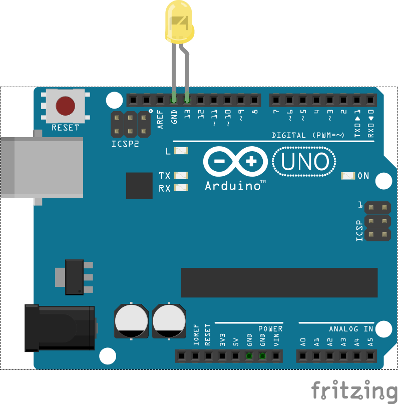

# Hello world

In this example we do the Hello World of hardware. Simply blink and LED on and
off under control from the program.

## Components needed

| # | Component         |
|---|-------------------|
| 1 | Arduino           |
| 1 | LED               |

## Build the circuit

Take the LED and put the long leg in Pin 13 and the short leg in Ground.

Ordinarily you need to use a resistor with the LED so you don't blow it up however
Pin 13 has a resistor on it already so this makes your life easy.



## Run the code

Run the code like this:

```
node 1_hello_world/led.js
```

The LED should now be blinking on and off. You may notice it blink a few times
quickly when the arduino starts up. This is because the firmware we use, `firmata`,
uses the LED on pin 13 to signal it's version details.

## Going further

Now you know how to blink a LED; a motor or a servo is no different. Try
varying the speed of the blinking or use PWM to fade it in and out.
