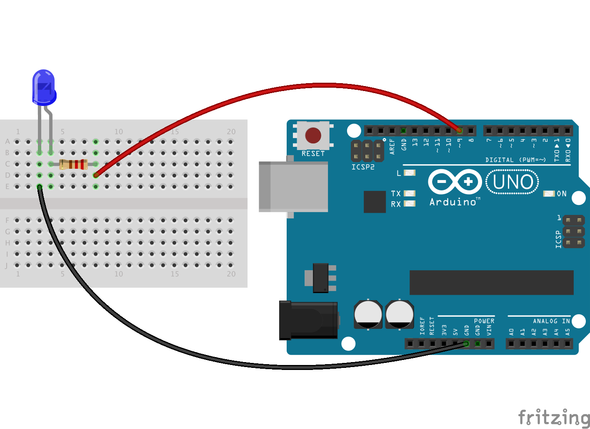

# Twitter keyword pulsar

This example looks at the twitter streaming API and pulses an LED each time
the keyword appears in the stream.

## Components needed

| # | Component         |
|---|-------------------|
| 1 | Arduino           |
| 1 | LED               |
| 2 | Jumper wires      |
| 1 | 220Ω Resistor     |

## Create your API application

To use the twitter API you will need to register your application and authenticate
it against your user account. You can do this in the following steps:

* Log into to twitter and [create a new application](https://apps.twitter.com/app/new)
* Enter in the details (website can be `http://127.0.0.1/` and leave callback URL empty). 
Agree to the terms and conditions.
* Go to permissions and make your application read only

### Update the token details

Open the file `2_info_radiator/twitter/access.js` and save your consumer keys
and access tokens in there.

## Build the circuit

Build the circuit as given below.



## Run the code

You can run the code by using the following:

```
node 2_info_radiator/twitter/twitter.js keyword
```

Where keyword is some search term you'd like to track. If you don't supply one
then you'll get the default which is "robot".

## Going further

* Hook up an RGB LED and then pulse the different colours to different keywords
* Count the occurrence of a keyword and then pulse the LED depending on the velocity


