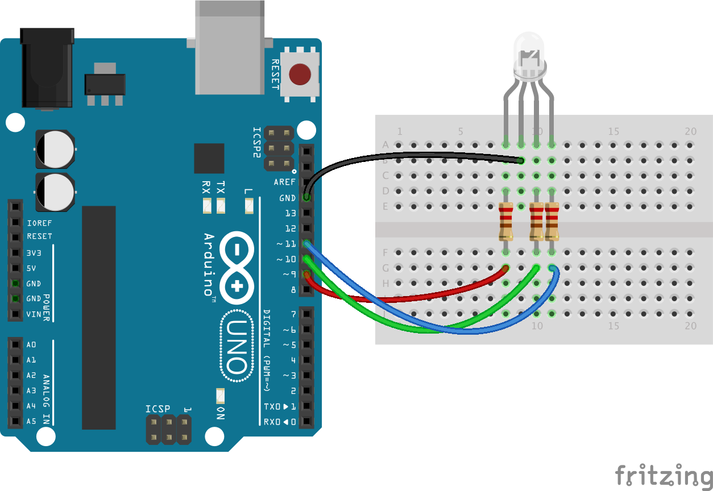

# Weather forecast light

THIS VERSION IS CURRENTLY BROKEN BECAUSE BOM HAVE CHANGED THEIR DATA FORMATS

This example shows you how to get weather data from a service and present
the forecast temperature as a light ranging from red (hot) to green (nice) to
blue (chilly).

This services uses BOM data to get the values and chooses the next value
coming up for the forecast that is relevant.


## Components needed

| # | Component         |
|---|-------------------|
| 1 | Arduino           |
| 1 | RGB LED           |
| 4 | Jumper wires      |
| 3 | 220Ω Resistors    |

## Circuit set up.

Set up the circuit using the diagram below. Things to note:

* the "long" leg is the cathode and should go to ground.
* If you look for the "flat" side of the LED head the pin on that side is the
red one.



The resistors on this circuit are Red, Red, Black, Black, Brown or Red, Red,
Brown, Gold.

## Running the application

### Get the forecast

You can run the application using:

``` bash
node 2_info_radiator/weather/weather.js --state VIC --location MELBOURNE
```

You should then get a value printed out on the command line and the LED
should change to a red hue if it's warm (>25 °C),  Green if it's mild (15-25°C) or
blue if it's chilly (<15°C).

### Choosing a location

You can figure out the station location you're interested in using the following
command:

``` bash
node 2_info_radiator/weather/weather.js --state VIC
```

Obviously, change the state value to one of `[VIC, NSW, Tas, QLD, NT, ACT, WA, SA]`


