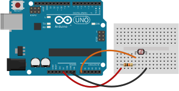

# Light sensor

In this example we'll use a light sensor and push the data into a chart on a
web page for visualisation. This will only be local but should give you a good
view of what type of data you can quickly create. In this case, no data will be
stored, it's purely visual only.

## Components needed

| # | Component         |
|---|-------------------|
| 1 | Arduino           |
| 1 | Photoresistor     |
| 3 | Jumper wires      |
| 1 | 10KΩ Resistor     |

## Build the circuit

Build the circuit as per the diagram below:



Check that you have the right type of resistor (Brown, Black, Black, Red, Brown 
if 5 bands or Brown, Black, Orange, Gold if 4 bands)

## Run the code

You can run the code with:

```
node 3_sensors/light/light.js
```

Once you run the code you should be able to open up [http://localhost:8001](http://localhost:8001)
and watch your light sensor provide data. It operates in the range 0-1023 so
see how different levels of light affect that.

## Going further

From here you can do all sorts of things:

* Use this data to determine when it is sunny or shady
* Log the data to a database over the course of the day
* Build a robot that is afraid of or loves the light
