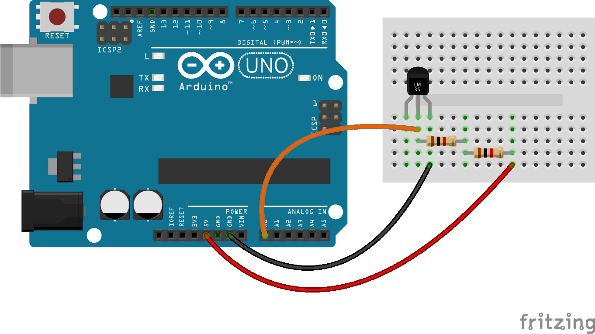

# Temperature sensor

In this example we'll use [Phant](http://phant.io) to log data from a temperature
sensor. Phant is an open source data acquistion and logging platform designed
and built by sparkfun. It's a good tool for being able to store data locally
from sensors.

## Components needed

| # | Component         |
|---|-------------------|
| 1 | Arduino           |
| 1 | LM335 temp sensor |
| 3 | Jumper wires      |
| 2 | 1KΩ Resistors     |

## Configure phant

Phant is installed as part of the npm install process. Open up a new terminal
window and run (Assumes your node_modules is in your execution path):

```
phant
```

Phant will now be running on both a telnet port (8081) and http port (8080)
by defualt.

Go to http://localhost:8080 and select "Create a Data Stream"

Fill in the field, using `temp` as the element for `fields` and then hit save.

You'll then get a screen with all of your pertinent information. Keep this to
hand but also save your keys file as `3_sensors/temperature/access_keys.json`.

Once this is complete, you can build the circuit and then start pushing data
to Phant.

Make sure you leave phant running while you're acquiring data!

## Build the circuit

Build the circuit as indicated below. Note that you need a 2KΩ resistor so you
can use 2x1KΩ resistors in series (series resistors are additive) instead.



## Run the code

You can run the code using

```
node 3_sensors/temperature/temp.js
```

You should see a temperature value be logged every 10 seconds. If you hold your
fingers on the sensor it should get warmer and you should see the data go up.

If you look at the [phant stream](http://localhost:8080/streams) and then select
your temperature logger, you should see the data in there.

## Going further

* Use the temperature to change the colour of a light
* Create a heatmap of your environment with multiple temperature sensors

